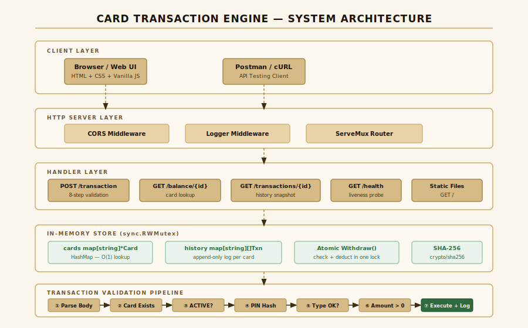

# Card Transaction Engine

🔗 **Live Demo:** https://card-transaction-engine-production.up.railway.app

📁 **GitHub:** https://github.com/SandeepXT/Card-Transaction-Engine

A payment-switch authorization engine built with Go, using only the standard library. Processes card transactions, validates PINs, maintains balances, and logs every attempt.

---

## Architecture



The system is structured in four horizontal layers:

- **Client Layer** — Browser dashboard (HTML/CSS/JS) and API testing tools (Postman, cURL)
- **HTTP Server Layer** — CORS middleware, request logger, and `net/http` ServeMux router
- **Handler Layer** — Five route handlers, each enforcing its own HTTP method and running a strict validation pipeline
- **Store Layer** — Two in-memory HashMaps protected by `sync.RWMutex`, with an atomic `Withdraw` and `Topup` that return the new balance in the same lock acquisition

---

## Project Structure

```
Card-Transaction-Engine/
├── cmd/server/main.go
├── internal/
│   ├── models/models.go
│   ├── store/
│   │   ├── store.go
│   │   └── crypto.go
│   ├── handlers/
│   │   ├── handlers.go
│   │   └── handlers_test.go
│   └── router/
│       ├── router.go
│       └── middleware.go
├── static/
│   ├── index.html
│   ├── css/style.css
│   └── js/app.js
├── postman/CTE_Collection.json
├── docs/architecture.svg
├── go.mod
└── README.md
```

---

## Requirements

- Go 1.21 or later — https://go.dev/dl

---

## Run

```bash
git clone https://github.com/SandeepXT/Card-Transaction-Engine.git
cd Card-Transaction-Engine
go run ./cmd/server/main.go
```

Open **http://localhost:8080**

Custom port:
```bash
PORT=9090 go run ./cmd/server/main.go
```

Build binary:
```bash
go build -o cte ./cmd/server/main.go
./cte
```

Run the binary from the project root so it can find the `static/` folder.

---

## Run Tests

```bash
go test ./internal/handlers/ -v
```

All 14 test cases cover: happy path withdraw/topup, invalid card, blocked card, wrong PIN, insufficient balance, invalid type, zero amount, invalid card format, audit log correctness, amount rounding, balance lookup, transaction history, and the health endpoint.

---

## Demo Cards

| Card Number          | Holder      | PIN  | Balance   | Status   |
|----------------------|-------------|------|-----------|----------|
| 4123456789012345     | John Doe    | 1234 | ₹1,000.00 | ACTIVE   |
| 4987654321098765     | Jane Smith  | 5678 | ₹2,500.00 | ACTIVE   |
| 4111111111111111     | Bob Wilson  | 9999 | ₹500.00   | BLOCKED  |

---

## API Reference

### POST /api/transaction

```json
{
  "cardNumber": "4123456789012345",
  "pin": "1234",
  "type": "withdraw",
  "amount": 200
}
```

**Validation pipeline (in order):**
1. Card number must be exactly 16 numeric digits
2. Card must exist in the store
3. Card must be ACTIVE
4. Transaction type must be `withdraw` or `topup`
5. Amount must be greater than 0 (rounded to 2 decimal places)
6. PIN SHA-256 hash must match stored hash

| respCode | Meaning               | HTTP |
|----------|-----------------------|------|
| 00       | Approved              | 200  |
| 05       | Invalid card / blocked / bad format | 404 / 403 / 400 |
| 06       | Wrong PIN             | 401  |
| 12       | Invalid type          | 400  |
| 13       | Invalid amount        | 400  |
| 99       | Insufficient balance  | 422  |

Success:
```json
{ "status": "SUCCESS", "respCode": "00", "balance": 800.00 }
```

Failure:
```json
{ "status": "FAILED", "respCode": "06", "message": "Invalid PIN" }
```

### GET /api/card/balance/{cardNumber}

Returns the current balance and card status. No PIN is required for this endpoint — in a production system, balance queries would require authentication (e.g. a session token). This is intentionally left open per the assessment spec.

```json
{ "cardNumber": "...", "cardHolder": "John Doe", "balance": 800.00, "status": "ACTIVE" }
```

### GET /api/card/transactions/{cardNumber}

```json
[{ "transactionId": "TXN...", "type": "withdraw", "amount": 200, "status": "SUCCESS", "timestamp": "..." }]
```

### GET /api/health

```json
{ "status": "ok", "service": "card-transaction-engine" }
```

---

## cURL Examples

```bash
# Health
curl http://localhost:8080/api/health

# Withdraw
curl -X POST http://localhost:8080/api/transaction \
  -H "Content-Type: application/json" \
  -d '{"cardNumber":"4123456789012345","pin":"1234","type":"withdraw","amount":200}'

# Top-up
curl -X POST http://localhost:8080/api/transaction \
  -H "Content-Type: application/json" \
  -d '{"cardNumber":"4987654321098765","pin":"5678","type":"topup","amount":500}'

# Wrong PIN
curl -X POST http://localhost:8080/api/transaction \
  -H "Content-Type: application/json" \
  -d '{"cardNumber":"4123456789012345","pin":"0000","type":"withdraw","amount":100}'

# Blocked card
curl -X POST http://localhost:8080/api/transaction \
  -H "Content-Type: application/json" \
  -d '{"cardNumber":"4111111111111111","pin":"9999","type":"withdraw","amount":100}'

# Insufficient balance
curl -X POST http://localhost:8080/api/transaction \
  -H "Content-Type: application/json" \
  -d '{"cardNumber":"4123456789012345","pin":"1234","type":"withdraw","amount":9999}'

# Balance lookup
curl http://localhost:8080/api/card/balance/4123456789012345

# Transaction history
curl http://localhost:8080/api/card/transactions/4123456789012345
```

---

## Postman

1. Postman → Import → select `postman/CTE_Collection.json`
2. `{{base_url}}` is pre-set to `http://localhost:8080`
3. All 11 requests are ready to run

---

## Security

- PINs are stored and compared as SHA-256 hashes only
- Raw PIN value is never logged, stored, or returned in any response
- The `PinHash` field carries `json:"-"` so it is excluded from all JSON output
- `Withdraw()` performs the balance check and deduction in one mutex acquisition, preventing TOCTOU races under concurrent requests
- `Topup()` similarly returns the new balance atomically
- Card number is validated as exactly 16 numeric digits before any store lookup
- Amount is rounded to 2 decimal places before processing (payment precision standard)

---

## Design Decisions

**No external packages.** Everything uses Go's standard library as specified in the assessment.

**`sync.RWMutex`** allows concurrent balance reads while serializing writes.

**Atomic `Withdraw` and `Topup`.** Both functions perform their operation and return the resulting balance inside a single exclusive lock. This eliminates two classes of race conditions: (1) the TOCTOU window where two concurrent withdrawals each pass the balance check before either deduction is recorded, and (2) the stale-read window where the response balance is fetched with a separate lock after the write.

**Validation order: format → existence → status → type → amount → PIN.** Type and amount are validated before the PIN so the audit log only ever records transactions with structurally valid fields. A request with an invalid type and a wrong PIN is rejected at the type check — no log entry is created — keeping the history clean.

**Failure logging.** Declined attempts with valid structure (wrong PIN, insufficient balance) are recorded in history with status FAILED, giving a complete audit trail.

**Snapshot reads.** `History()` returns a copy of the slice so callers cannot modify stored records.

**Go 1.21 compatibility.** Method-prefixed route patterns introduced in Go 1.22 are deliberately avoided. Method enforcement happens inside each handler.

**Balance endpoint requires no auth.** Per the assessment spec, `GET /api/card/balance/{cardNumber}` is open. In a production system this would require a session token or equivalent. The tradeoff is documented here rather than silently accepted.
